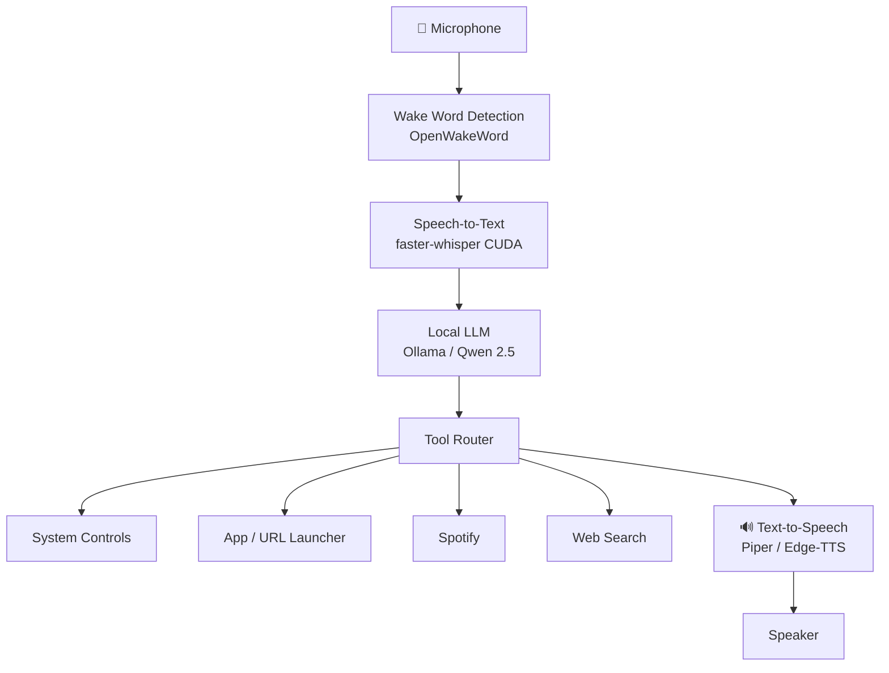

<div align="center">

<h1>🤖 ARIA</h1>
<h3>Autonomous Reasoning & Intelligent Assistant</h3>

[](https://python.org)
[](https://ollama.com)
[](https://github.com/zn200/ARIA_PUBLIC)
[](LICENSE)

**A fully local, voice-enabled AI assistant that runs entirely on your hardware.**
No cloud. No subscriptions. No data leaving your machine.

[**Quick Start**](#quick-start) · [**Features**](#features) · [**Platform Support**](#platform-support) · [**Contributing**](#contributing)

</div>

---

## Windows

ARIA was developed on Linux but is **fully Windows-compatible** as of commit [`de5ed62`](https://github.com/zn200/ARIA_PUBLIC/commit/de5ed62). All Linux-specific subsystems (audio, clipboard, notifications, system controls) have Windows equivalents wired in, and the app handles a missing or corrupted Whisper cache gracefully on first run.

For a step-by-step manual install — prerequisites, venv setup, `.env` configuration, Whisper cache fixes, and a full troubleshooting section — see the **[Windows Setup Guide](docs/WINDOWS_SETUP.md)**.

> **Quickest path:** install Python 3.11+, Ollama, and Git — then `git clone`, `pip install -r requirements.txt`, and `python app.py`. A default `.env` (password: `aria`) is created automatically on first launch.

---

## Why ARIA?

Most voice assistants depend on cloud APIs, remote servers, and subscriptions. ARIA is different:

- **Private** — nothing is sent to any server. ever.
- **Local-first** — runs fully on your hardware, even offline
- **Proactive** — ARIA doesn't just respond, she initiates. news alerts, reminders, unprompted messages
- **Moddable** — open source, fully hackable, no black boxes
- **Ownership-oriented** — your assistant, your data, your hardware

Most local AI projects are chat wrappers. ARIA is an actual assistant.

---

## What is ARIA?

ARIA listens for her wake word, understands your voice, thinks with a local LLM, and responds naturally. She can open apps, search the web, control Spotify, manage your system, and hold real conversations — and remembers things across sessions.

Unlike Alexa, Siri, or ChatGPT Voice — ARIA runs entirely on your machine.

| | ARIA | ChatGPT Voice | Alexa | Siri |
|---|:---:|:---:|:---:|:---:|
| Fully local | ✅ | ❌ | ❌ | ❌ |
| Offline capable | ✅ | ❌ | ❌ | ❌ |
| Open source | ✅ | ❌ | ❌ | ❌ |
| Proactive behavior | ✅ | ❌ | ⚠️ | ❌ |
| Persistent memory | ✅ | ❌ | ⚠️ | ❌ |
| Custom tools | ✅ | ❌ | ⚠️ | ❌ |

---

## Features

| | Feature | Description |
|---|---|---|
| 🎙️ | **Wake Word** | Always-on, fully offline detection via OpenWakeWord |
| 🗣️ | **Speech Recognition** | CUDA-accelerated via faster-whisper — auto-selects model based on your GPU |
| 🧠 | **Local LLM** | Ollama-powered — tested with Qwen 2.5 14B, works with any compatible model |
| 🔊 | **Voice Synthesis** | Piper TTS (offline) with Edge-TTS fallback |
| 💾 | **Persistent Memory** | Remembers useful context across sessions using an LLM-filtered memory store |
| 🛠️ | **Tool Calling** | Opens apps, URLs, controls volume, reads clipboard, runs bash, and more |
| 🌍 | **World Intelligence** | Background RSS aggregator with proactive breaking news alerts |
| ⚡ | **Proactive Engine** | ARIA initiates — reminds you, flags news, speaks unprompted |
| 🎵 | **Spotify Control** | Play, pause, skip, search — all by voice |
| 📸 | **Screenshots** | Capture and save your screen on command |
| 🔒 | **Password Lock** | Optional lock screen to protect your instance |
| 🖥️ | **Web UI** | Flask dashboard with chat, bash execution, and file viewer |

> **Offline vs Online:** Core assistant features (wake word, STT, LLM, TTS, memory) work fully offline. Optional features like Spotify, web search, and Edge-TTS require internet access.

---

## Example Commands

```
"ARIA, open Spotify"
"ARIA, what's the latest news?"
"ARIA, pause the music"
"ARIA, remember that my server IP is 10.0.0.5"
"ARIA, take a screenshot"
"ARIA, set volume to 40"
"ARIA, search for Python async tutorials"
"ARIA, run diagnostics"
```

---

## Architecture



---

## Quick Start

**Prerequisites:** Python 3.10+, [Ollama](https://ollama.com) installed and running

```bash
# 1. Clone the repo
git clone https://github.com/zn200/ARIA_PUBLIC.git
cd ARIA_PUBLIC

# 2. Run setup (creates .env, installs dependencies, checks Ollama)
python setup.py

# 3. Pull a model
ollama pull qwen2.5:7b

# 4. Launch
python app.py
```

Then open **http://localhost:5000** in your browser.

> On first run, `setup.py` guides you through configuration — model selection, wake word sensitivity, and optional password setup.

---

## Installation

### Windows — Installer (.exe)

The recommended way to install ARIA on Windows 10/11.

**Before you start, install these two prerequisites:**

| Prerequisite | Download | Notes |
|---|---|---|
| Python 3.11 or 3.12 (64-bit) | [python.org/downloads](https://www.python.org/downloads/) | Check **"Add Python to PATH"** during install |
| Ollama | [ollama.com/download](https://ollama.com/download) | Required for the local LLM |

**Then run the installer:**

1. Download **[ARIA_Setup.exe](https://github.com/zn200/ARIA_PUBLIC/releases/latest/download/ARIA_Setup.exe)** from the [latest release](https://github.com/zn200/ARIA_PUBLIC/releases/latest).
2. Double-click it — no admin rights required.
3. The installer will:
   - Verify Python and Ollama are present (and open the download page if not)
   - Copy ARIA to `%LocalAppData%\ARIA`
   - Create a Python virtual environment and install all dependencies
   - Pull `qwen2.5:7b` via Ollama (~4.7 GB download)
   - Run the interactive configuration wizard (`setup.py`)
   - Create a **Desktop shortcut** and **Start Menu entry**
4. On the final screen, tick **"Launch ARIA now"** to open the web UI immediately.

---

### Windows — Fallback (install.bat)

For environments where you cannot run unsigned `.exe` files (e.g. managed corporate machines). Requires the full repo to be present locally.

```bat
git clone https://github.com/zn200/ARIA_PUBLIC.git
cd ARIA_PUBLIC\installer
install.bat
```

`install.bat` performs the same steps as the graphical installer: copies files, creates a venv, installs packages, pulls the model, runs `setup.py`, and creates shortcuts.

**To uninstall** (bat install only):

```bat
installer\uninstall.bat
```

> If you used the `.exe` installer, uninstall through **Windows Settings → Apps → ARIA**.

---

### Build the installer yourself

Requires [Inno Setup 6.3+](https://jrsoftware.org/isinfo.php).

```bat
iscc installer\aria_setup.iss
```

Output: `installer\dist\ARIA_Setup.exe`

---

## Hardware Requirements

**Recommended:**
- NVIDIA GPU with 8 GB+ VRAM (for real-time STT + LLM)
- 16 GB RAM
- SSD storage (model load times are significantly faster)

**VRAM Guide:**

| VRAM | Whisper Model (auto) | Recommended LLM |
|---|---|---|
| No GPU | tiny (CPU) | `qwen2.5:3b` |
| 4 GB | small | `qwen2.5:3b` |
| 8 GB | medium | `qwen2.5:7b` |
| 12 GB+ | medium (float16) | `qwen2.5:14b` |

ARIA detects your GPU at startup and selects the right configuration automatically.

---

## Platform Support

| Feature | Windows | Linux | macOS |
|---|:---:|:---:|:---:|
| Voice assistant core | ✅ | ✅ | ✅ |
| Wake word detection | ✅ | ✅ | ✅ |
| Speech recognition (CUDA) | ✅ | ✅ | ✅ |
| System controls (volume, sleep, lock) | ✅ | ✅ | ✅ |
| App & URL launching | ✅ | ✅ | ✅ |
| Spotify control | ✅ | ✅ | ✅ |
| Clipboard read/write | ✅ | ✅ | ✅ |
| Screenshots | ✅ | ✅ | ✅ |
| Notifications | ✅ | ✅ | ✅ |

---

## Configuration

All settings live in `.env` (auto-generated by `setup.py`):

```env
OLLAMA_MODEL=qwen2.5:14b
WHISPER_MODEL=            # leave blank for auto-detection
ARIA_PASSWORD=            # optional lock screen
TTS_VOICE=en-GB-SoniaNeural
```

Override Whisper model at runtime:
```bash
WHISPER_MODEL=small python app.py
```

> ⚠️ **Security note:** Bash execution is a powerful feature and should only be enabled on trusted local machines. ARIA can execute system commands — treat her accordingly.

---

## Roadmap

- [ ] Vision support (describe what's on screen)
- [ ] Local RAG memory (query your own documents)
- [ ] Home Assistant integration
- [ ] Multi-agent workflows
- [ ] Plugin SDK for custom tools
- [ ] Docker image
- [x] Windows installer / Linux AppImage

---

## Changelog

See [CHANGELOG.md](CHANGELOG.md) for notable changes.

---

## Built With

- [faster-whisper](https://github.com/SYSTRAN/faster-whisper) — Speech recognition
- [Ollama](https://ollama.com) — Local LLM inference
- [OpenWakeWord](https://github.com/dscripka/openWakeWord) — Wake word detection
- [Piper TTS](https://github.com/rhasspy/piper) — Offline voice synthesis
- [Edge-TTS](https://github.com/rany2/edge-tts) — Online TTS fallback
- [Flask](https://flask.palletsprojects.com) — Web interface

---

## Contributing

Pull requests are welcome. For major changes, open an issue first.

See [CONTRIBUTING.md](CONTRIBUTING.md) for guidelines and [CODE_OF_CONDUCT.md](CODE_OF_CONDUCT.md) for community standards.

---

## License

[MIT](LICENSE) © [Ziyad Noucair](https://github.com/zn200)

---

<div align="center">
<sub>Built with 🤍 by <a href="https://github.com/zn200">zn200</a> — local AI, the way it should be</sub>
</div>
